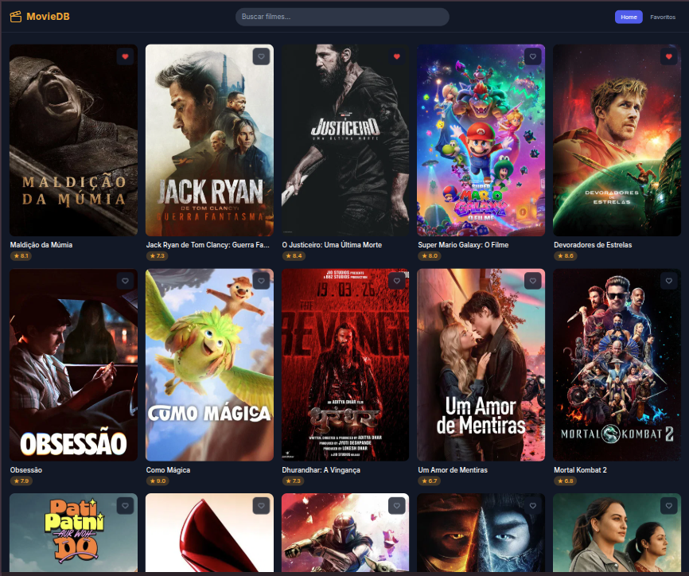

# Movie DB



Aplicação React para explorar filmes, ver detalhes e gerenciar uma lista de favoritos, consumindo a API do [The Movie Database (TMDB)](https://www.themoviedb.org/).

## Funcionalidades

- **Filmes populares** — grid responsivo com infinite scroll
- **Detalhes do filme** — backdrop, gêneros, data de lançamento, nota e sinopse
- **Favoritos** — lista persistida no localStorage com ordenação por título e nota
- **Busca** — resultados em tempo real com destaque do termo buscado nos títulos
- **Favoritar em qualquer página** — ícone de coração nos cards e botão na página de detalhes

## Tecnologias

- React 19 + TypeScript
- React Router v7
- Context API (gerenciamento de favoritos)
- Axios
- TanStack Query v5 (cache e infinite scroll)
- Tailwind CSS v4
- Jest + React Testing Library

## Pré-requisitos

- Node.js 18+
- Conta gratuita no [TMDB](https://www.themoviedb.org/) para obter uma API Key

## Instalação

```bash
# 1. Clone o repositório
git clone https://github.com/fernandes-vinicius/movie-db.git
cd movie-db

# 2. Instale as dependências
npm install

# 3. Configure as variáveis de ambiente
cp .env.example .env.local
```

Abra `.env.local` e preencha sua API Key do TMDB:

```env
VITE_TMDB_API_KEY=sua_api_key_aqui
VITE_TMDB_BASE_URL=https://api.themoviedb.org/3
VITE_TMDB_IMAGE_BASE_URL=https://image.tmdb.org/t/p
```

> Gere sua API Key gratuitamente em: https://www.themoviedb.org/settings/api

## Execução

```bash
# Desenvolvimento
npm run dev

# Build de produção
npm run build

# Preview do build
npm run preview
```

## Testes

```bash
# Executar todos os testes
npm test

# Modo watch
npm run test:watch

# Relatório de cobertura
npm run test:coverage
```

## Estrutura do Projeto

```
src/
├── api/                  # Endpoints e cliente HTTP (Axios)
├── app/
│   ├── routes/           # Páginas (Home, Search, MovieDetails, Favorites)
│   ├── router.tsx
│   └── app.tsx
├── features/
│   ├── favorites/        # Componentes, hooks e utils de favoritos
│   ├── movie-details/    # Componentes e hooks da página de detalhes
│   ├── movies/           # MovieCard, MovieGrid, MovieRatingBadge
│   └── search/           # Componentes e hooks de busca
└── shared/
    ├── components/       # Header, ErrorBoundary, componentes de UI
    ├── contexts/         # FavoritesContext
    ├── hooks/            # useLocalStorage
    ├── types/            # Tipos do TMDB
    └── utils/            # formatDate, getImageUrl, sortFavorites
```

## Rotas

| Rota | Descrição |
|---|---|
| `/` | Filmes populares com infinite scroll |
| `/movie/:id` | Detalhes do filme |
| `/favorites` | Lista de favoritos com filtros de ordenação |
| `/search?q=termo` | Resultados de busca com destaque do termo |

## Variáveis de Ambiente

| Variável | Descrição |
|---|---|
| `VITE_TMDB_API_KEY` | Chave de API do TMDB (obrigatória) |
| `VITE_TMDB_BASE_URL` | URL base da API do TMDB |
| `VITE_TMDB_IMAGE_BASE_URL` | URL base para imagens do TMDB |
